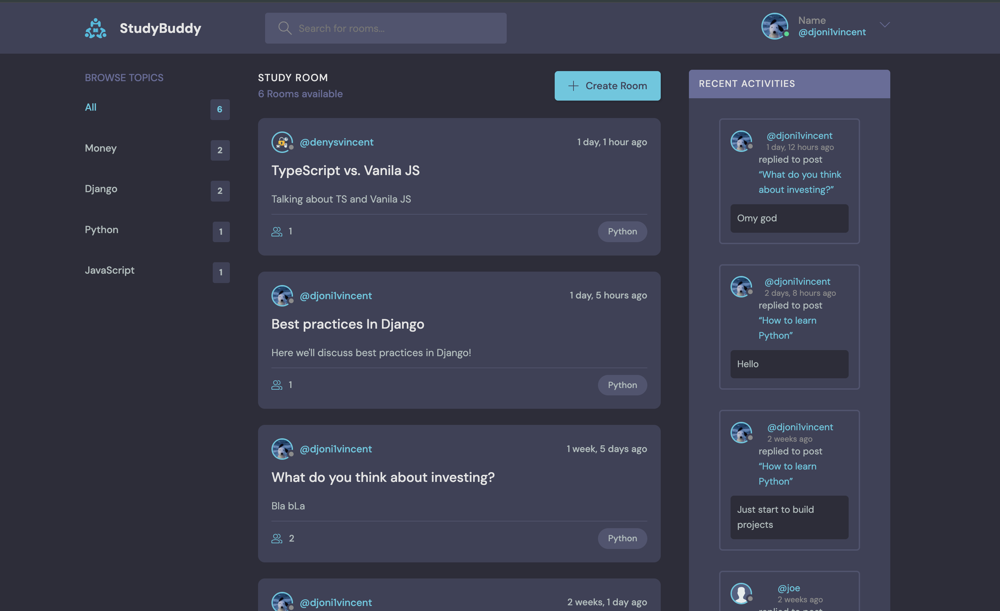

# courseprj

A Django learning project — a discussion room (forum) application with topics and activity feeds.

Built while following the [Django 7 Hour Course (Dennis Ivy)](https://www.youtube.com/watch?v=PtQiiknWUcI) and Django's official documentation.



## Features

- User registration, authentication, and profile management
- Create, edit, and delete rooms
- Comments inside rooms (create, edit, delete)
- Search rooms by name, topic, and description
- Topic categories for rooms with room count
- Dedicated topics browsing page (`/topics/`)
- Recent activity feed (`/activities/`)
- User profiles with avatar upload and bio
- Responsive layout with mobile-friendly navigation

## Stack

- Python 3.13
- Django 6.0
- SQLite
- uv

## Setup

```bash
uv sync
python manage.py migrate
python manage.py runserver
```

Open http://127.0.0.1:8000/

## Project Structure

- `base/` — main app (models, views, templates, forms)
- `courseprj/` — project config (settings, urls)
- `templates/` — shared base templates (main.html, navbar)
- `static/` — static files (styles, scripts, images)

## URL Reference

| URL | Name | Description |
|-----|------|-------------|
| `/` | `home` | Main page with rooms, topics, and activity |
| `/topics/` | `topics` | Browse all topics |
| `/activities/` | `activities` | Recent activity feed |
| `/login/` | `login` | Login page |
| `/register/` | `register` | Registration page |
| `/logout/` | `logout` | Logout |
| `/profile/<username>/` | `user-profile` | User profile page |
| `/room/<pk>/` | `room` | Room detail with comments |
| `/create-room/` | `create-room` | Create a new room |
| `/update-room/<pk>/` | `update-room` | Edit a room |
| `/delete-room/<pk>/` | `delete-room` | Delete a room |
| `/update-user/` | `update-user` | Edit user profile |
| `/delete-comment/<pk>/` | `delete-comment` | Delete a comment |
| `/edit-comment/<pk>/` | `edit-comment` | Edit a comment |


